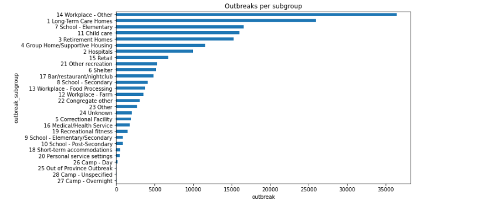
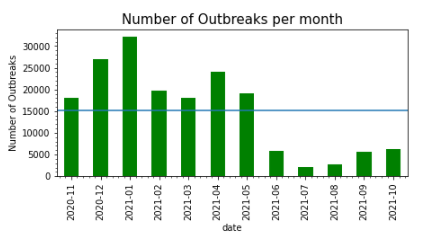
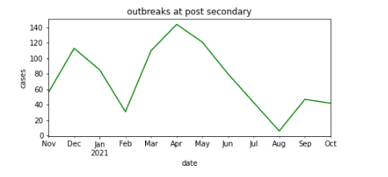
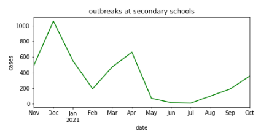
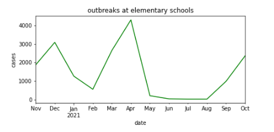
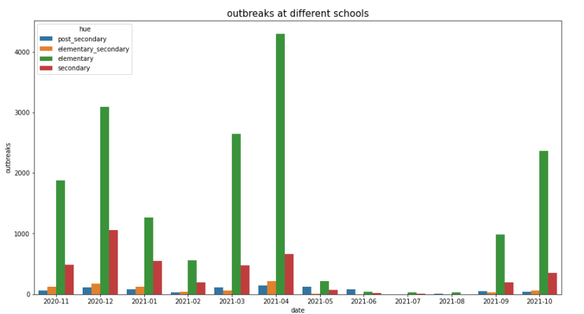
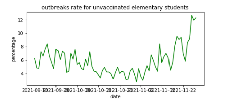
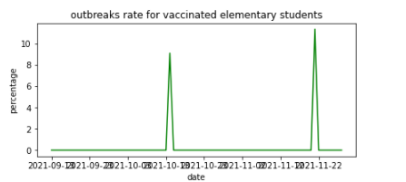

# Analyzing Covid-19 Outbreaks in Ontario 
### About us (Name - Github ID)

Vishwaajeeth Kamalakkannan - Vishwaajeeth 

Haider bajwa - printhaider

Vrund Patel - Vrund-Patel

Fahad Fauzan - fahadf-14
#
Over the past year, the world has been shaken by the novel Corona virus. From schools to work, the way we do everything has changed. What's important for us now is to learn how we can overcome this epedemic and that is where data analysis is very crucial. In this report we will be analyzing outbreaks across Ontario and looking into important details such as which group was most affected?When did the number of outbreaks increase and how the return of school has had on cases. The first dataset we used in this project is the "Ongoing outbreaks" dataset which was provided from data.ontario (https://data.ontario.ca/dataset/ontario-covid-19-outbreaks-data/resource/66d15cce-bfee-4f91-9e6e-0ea79ec52b3d)
The dataset (as of october 29) has 8085 reocords. It includes 7 unique outbreak groups:
* Workplace
* Congregate Care
* Education  
* Congregate Living
* Recreational
* Other/Unknown
* Out of Province Outbreak
 
###
the dataset also includes 28 unique outbreak subgroups (they are specific like elementary school etc). The data starts from 2020-11-01 till 2021-10-28 ( dataset itself is updated weekly but we chose to use a dated file as it is easier to keep data results). 
The second dataset we used in this project was "Case rates by vaccination status and age group" also provided through data.ontario (https://data.ontario.ca/dataset/covid-19-vaccine-data-in-ontario/resource/c08620e0-a055-4d35-8cec-875a459642c3)
This dataset focuses on the outbreak rates per different vaccination status across different age groups. It includes the dates and the following age groups:
* 0-11 years
* 12-17 years 
* 18-39 years
* 40-59 years
* 60-79 years
* 80+ years
* 0-11 years

Other than the ager groups, the data set includes categories of the following to help us better understand outbreaks relations to vaccination status: 
* cases_unvac_rate_per100K : unvaccinated group
* cases_partial_vac_rate_per100K : partially vaccinated group
* cases_full_vac_rate_per100K : fully vaccinated group
* cases_unvac_rate_7ma : unvaccinated group 7 day moving average
* cases_partial_vac_rate_7ma partially partially vaccinated groupvaccinated group 7 day moving average
* cases_full_vac_rate_7ma : fully vaccinated group 7 day moving average

### Discussion
Upon researching, we had found several interesting stuff which at the end of the day helped us better understand Covid-19. One being the outbreaks being categorized. 

Figure 1:

As seen in figure 1, we came to know that most outbreaks happened in the workplace. This makes sense because that is where alot of people spend majority of their day. The second highest one was the Long-Term care homes, this is because older people have weaker immune systems so it is much easier having an outbreak there. What surprised us were how there were some Medical/Health service cases. We believe that these were caused by an outbreak amongst the staff, this goes to show that even the most sanitary places can still experience outbreaks.

###
After categorizing the cases, we decided to check on the trend of the outbreaks such increases, decreases and statistical values such as mean. Here we attached a visual representation of the outbreaks categorized by months: 

Figure 2:

The blue line included in the graph above (figure 2) shows the average amount of cases per month which was 15082 covid infections per month. The first 7 months of outbreaks stayed above the monthy average and after that it dropped. The number of Cases started to increase from 2020-11 till 2021-01 ( 2 months) as after that the cases seemed to have significanlty drop. From the data, a second wave is apparent as when rules started to get a bit lax, from 2021-03 till 2021-04 ( 1 month) cases started to uptrend alot. From that point onwards, the monthly amount of cases significantly dropped. 

What we found quite interesting was how after the drop (2021-05 - 2021-06), the cases started to gradually increase again. Most importantly they increased alot from september 2021, that is the time of the year when the government pushed the narrative of "safe and normal" return to school but has it really been? We decided to further analyze the data by using the groups and sub group categories to help us narrow down to our target demographic which was the elementary students. We split up the data into elementary students, secondary students and post-secondary students. here are some visual representations of our findings:

Figure 3:

Here in the line graph above (figure 3). We found that there were an increase in cases in august 2021 but it was handled and the following months showed a downtrend

Figure 4:

Here in the line graph above (Figure 4). We found that there was a steady increase in cases starting from July.The trend of the line is steeply upwards showing the likely hood of this continuing.

Figure 5:

here in the last line graph (figure 5) which reprsents the elementary students, shows a massive increase of cases from august with line trend steeply high like an exponential graph.

Figure 6:

Here in the last graph (Figure 6), we had combined all of our school findings into a bar graph showing the number of outbreaks.

After carefully analyzing all the charts as well as the combined chart at the end. We have concluded that the push of a 'safe and normal' return to school did not hold up to its statement. When the province went into the second lockdown last school year, elementary schools experienced a peak of 4300 breakouts in April. Over the months of May 2021 - August 2021, Students at all levels of educations had less than 300 cases as the lockdown continued. When the government assured that it was safe to return to school, the cases started to rise. From August 2021 to September 2021 there was an increase of 3187% of cases among elementary students while other instituitions did not experience much. The following month received an increase of 238% from the previous amount and now the outbreaks stand at 2360.

The age group 0-14 makes 15.3%(link: https://www150.statcan.gc.ca/n1/daily-quotidien/210929/cg-d003-eng.htm) of Ontario's population. The average monthly cases across Ontario are 15,082 outbreaks a month. Onto our previous findings, elementary students made upto (2,360/15,082 X 100) 15.6% of the total cases. That number had gone up 238% from the previous month(6.5% ~ 988 cases from the average). Our findings suggest that ever since the government re-introduced in person learning, the cases amongst elementary students has been in an uptrend and has already reached 54% of last lockdowns all time highs. This goes onto prove that no, school has not been safe and these findings suggest that we might have more problems along the way, potentially as a 3rd lockdown.

Out of pure curiosity, we wanted to know if there were any trends with vaccination status and covid amongst elmentary students. Here we have concluded 2 graphs, one for vaccinated and the other for unvaccinated:

Figure 7:

Figure 8:

As you the viewer, can see that the difference between both is very significant. Outbreak percentage by vaccinated students was near zero most of the school year with occasional spikes caused due to low volume of cases. Then that raises the question, are all the cases coming from unvaccinated students? The first graph here suggests that unvaccinated students are more likely to get covid and it is more apparent as the percentage has nearly doubled itself from October to November. This goes to show us that in order to protect your kids from covid-19, full vaccination is a must.

In conclusion, our research on covid-19 outbreaks in Ontario using Data.ontario provided datasets have helped us better understand the virus. With the knowledge and skills we have learnt in our data analysis class have better prepared us in making these discoveries as we were able to efficently process large amounts of data and find out which places have high outbreaks, outbreak trends as well as see if our government was right about the "safe and normal" return for elementary students. We believe that like every project, there is always room for improvment. As we look back on this project one thing we could improve on is using an automatic updating data set which updates the charts every week as we believe that covid trends could change at any given time and its important to take current data into account.
#

## ReadME
In order to run the data mentioned in this blog report, you will need to run the following code:

## Acknowledgements
This project was submitted as the final course project for CSCI 2000U “Scientific 
Data Analysis” during Fall 2021. The authors certify that the work in this 
repository is original and that all appropriate resources are rightfully cited.
